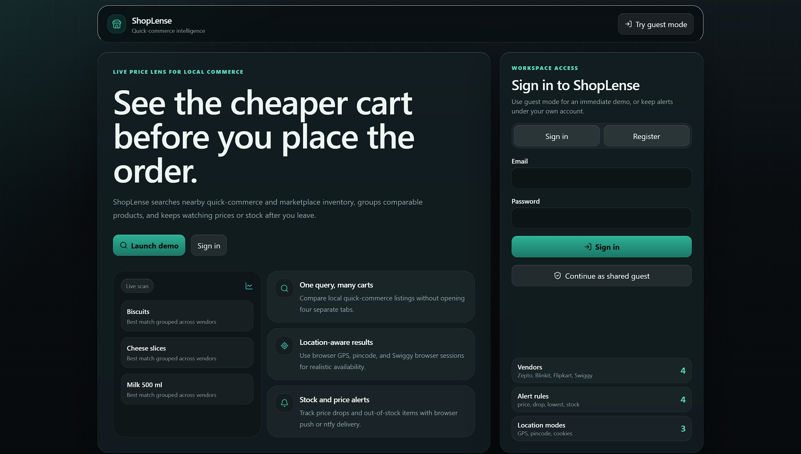
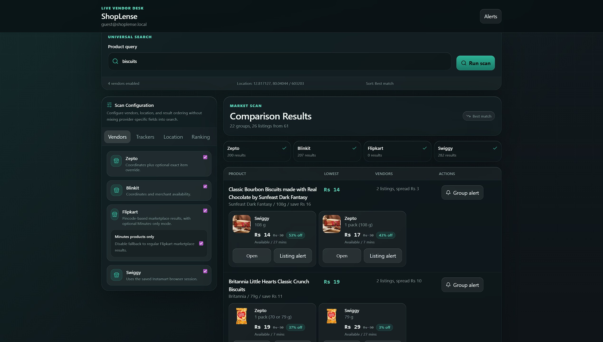
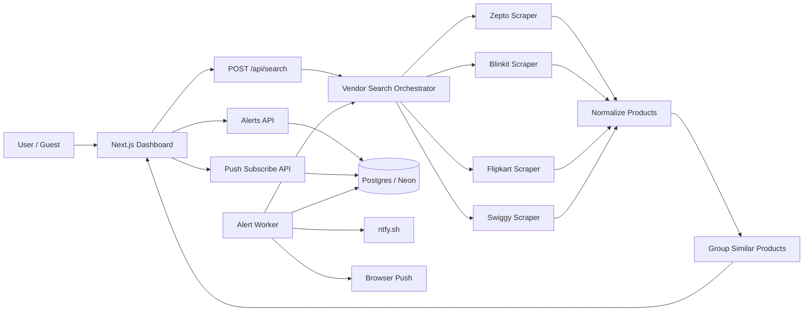
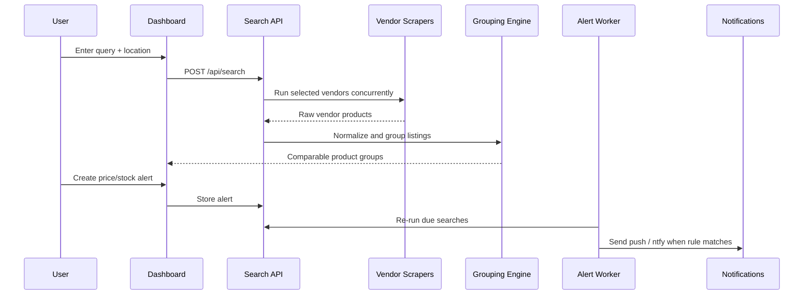
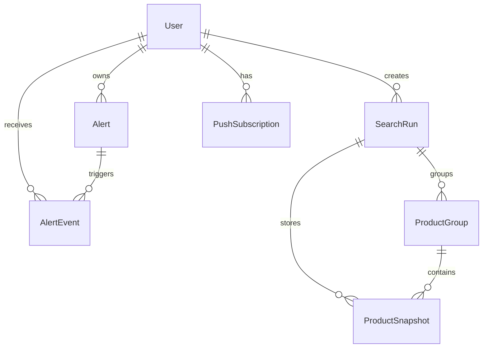

# ShopLense

ShopLense is a full-stack quick-commerce intelligence dashboard that compares live product prices and availability across Zepto, Blinkit, Flipkart/Flipkart Minutes, and Swiggy Instamart. It combines custom-built marketplace scrapers, normalized product matching, location-aware search, stock tracking, and alert delivery into one SaaS-style dashboard.

The project was built as an end-to-end portfolio system: reverse-engineered vendor integrations, a production-style Next.js application, database-backed alerts, background workers, authentication, and a polished dark-mode interface.





## Highlights

- **Multi-vendor live search** across Zepto, Blinkit, Flipkart/Minutes, and Swiggy Instamart.
- **Location-aware results** using browser geolocation, pincode input, vendor store resolution, and Swiggy browser-session cookies.
- **Custom scraper layer** built from observed marketplace web traffic rather than third-party APIs.
- **Product normalization and grouping** to compare equivalent listings across different vendors.
- **Out-of-stock tracking** with exact product trackers and back-in-stock reminders.
- **Price intelligence UI** showing offer price, strikethrough MRP, discount percentage, delivery SLA, vendor spread, and availability.
- **Alert engine** for price thresholds, discount drops, lowest-vendor matches, and restock notifications.
- **Notification delivery** through browser push and ntfy.sh webhooks.
- **Background worker** for recurring alert checks.
- **Guest demo mode** backed by a reusable shared account.
- **Postgres persistence** through Prisma with optional search snapshot storage.

## Why This Project Is Interesting

Most quick-commerce comparison demos stop at static data or one marketplace. ShopLense handles the harder parts:

- every vendor has a different location model;
- some vendors omit out-of-stock products from search entirely;
- marketplace responses are deeply nested UI JSON rather than clean public APIs;
- product names, brands, quantities, and prices are inconsistent across vendors;
- Swiggy Instamart depends on browser cookies and selected delivery location;
- alert checks must run outside the request/response lifecycle.

ShopLense solves those as real engineering problems instead of mocking the marketplace layer.

## Architecture



## Data Flow



## Core Features

### 1. Unified Marketplace Search

The dashboard accepts one query and runs selected vendors concurrently. Partial failures are isolated, so if one marketplace blocks or times out, successful vendor results still render.

Supported vendors:

| Vendor | Location Input | Integration Style |
| --- | --- | --- |
| Zepto | latitude / longitude | BFF search + serviceability + product-detail |
| Blinkit | latitude / longitude | web layout search snippets |
| Flipkart Minutes | pincode | Flipkart page fetch API with `HYPERLOCAL` marketplace |
| Swiggy Instamart | browser session location | search API with Playwright-generated cookies |

### 2. Product Grouping

Marketplace listings are normalized into a shared model:

```ts
type VendorProduct = {
  id: string;
  vendor: "ZEPTO" | "BLINKIT" | "FLIPKART" | "SWIGGY";
  name: string;
  brand: string;
  quantity: string;
  mrp: number | null;
  offerPrice: number | null;
  available: boolean;
  deeplink: string | null;
};
```

The grouping engine:

- normalizes product names;
- strips low-signal words;
- normalizes quantities like `1 kg` to `1000g`;
- checks brand compatibility;
- compares token similarity;
- prevents unrelated products from being grouped just because they share broad terms.

This was important for cases like cheese slices, where different brands should not collapse into one group.

### 3. Smarter Result Ordering

ShopLense includes client-side ranking controls:

- relevance;
- lowest price;
- highest discount amount;
- vendor price spread;
- must-include search keywords.

This helps searches such as product-specific queries avoid being buried under loosely related marketplace results.

### 4. Exact Product Trackers

Some marketplaces hide out-of-stock products from normal search responses. ShopLense provides a separate **Trackers** tab for exact product URLs.

Behavior:

- **Zepto** can fetch product-detail for exact product variant ids and detect out-of-stock state directly.
- **Blinkit, Flipkart, and Swiggy** insert a disabled placeholder if search omits the product, allowing the user to create a back-in-stock alert.
- The worker later triggers when that exact product id appears as available again.

### 5. Flipkart Minutes-Only Mode

Flipkart can mix hyperlocal Minutes inventory with regular marketplace results. ShopLense exposes a **Minutes products only** toggle that disables fallback to the regular marketplace.

Internally, this passes:

```ts
{
  marketplace: "HYPERLOCAL",
  allowFallback: false
}
```

The same flag is persisted on alerts so scheduled checks preserve the user’s original intent.

### 6. Alert Engine

Users can create alerts from a whole product group or one vendor listing.

Supported rules:

- price below target;
- lowest vendor below target;
- percentage drop from current price;
- back in stock.

Delivery methods:

- browser push notifications;
- ntfy.sh webhook topics.

The alert worker reruns due searches, matches products, evaluates rules, records events, and sends notifications.

## Scraper Engineering

All vendor scripts were built from scratch by inspecting live web traffic and recreating the necessary browser requests in Node.js.

### Zepto

File: [`zepto_scraper.js`](zepto_scraper.js)

Zepto required the most request reconstruction:

- serviceability endpoint to resolve the local store from lat/lon;
- signed BFF search requests;
- store headers such as `storeId`, `store_ids`, and ETA maps;
- product-detail endpoint for exact out-of-stock tracking;
- CDN image URL reconstruction;
- deduplication by product variant id.

### Blinkit

File: [`blinkit_scraper.js`](blinkit_scraper.js)

Blinkit search returns UI snippets rather than a clean product list. The scraper:

- calls the layout search endpoint;
- extracts `product_card_snippet_type_2` widgets;
- handles pagination via `next_url` and `postback_params`;
- derives product ids, merchant ids, prices, inventory, ETA, and deeplinks.

### Flipkart

File: [`flipkart_scraper.js`](flipkart_scraper.js)

Flipkart uses a page fetch API with page context and location context. The scraper:

- builds the `pageUri` and request context;
- sends pincode in `locationContext`;
- requests `marketplace=HYPERLOCAL` for Flipkart Minutes;
- optionally disables fallback;
- extracts `PRODUCT_SUMMARY` slots;
- reconstructs product links and image URLs.

### Swiggy Instamart

File: [`swiggy_scraper.js`](swiggy_scraper.js)

Swiggy depends on browser session state. The scraper:

- reads `swiggy_cookie.txt` or `SWIGGY_COOKIE`;
- extracts device id from cookies when possible;
- sends Instamart search requests with session headers;
- handles variation selection;
- uses Instamart product ids for canonical item URLs.

Swiggy location cookies can be generated with:

```bash
npm run swiggy:location -- --lat 12.817127 --lon 80.04044 --pincode 603203
```

That helper uses Playwright CLI to open Swiggy, grant geolocation permission, set browser geolocation, and save cookies.

## System Components

| Layer | Files | Responsibility |
| --- | --- | --- |
| App Router | `src/app` | pages and API routes |
| UI | `src/components` | landing, dashboard, alerts |
| Scraper orchestration | `src/lib/vendor-search.ts` | concurrent vendor search and normalization |
| Grouping | `src/lib/product-normalization.ts` | product matching and canonical groups |
| Ranking | `src/lib/result-ranking.ts` | filtering and sorting |
| Auth | `src/lib/auth.ts` | NextAuth credentials auth |
| Database | `prisma/schema.prisma` | users, searches, snapshots, alerts, events |
| Worker | `scripts/alert-worker.js` | scheduled alert checks |
| Swiggy setup | `scripts/swiggy-location-cookie.js` | Playwright cookie generation |

## Database Model



Primary models:

- `User`
- `SearchRun`
- `ProductSnapshot`
- `ProductGroup`
- `Alert`
- `AlertEvent`
- `PushSubscription`

Search snapshot persistence is configurable with:

```env
PERSIST_SEARCH_SNAPSHOTS="0"
```

This keeps normal live searches fast and avoids writing every result to the database unless explicitly enabled.

## Tech Stack

- Next.js 15
- React 19
- TypeScript
- Tailwind CSS v4
- Prisma
- Postgres / Neon
- NextAuth
- bcryptjs
- zod
- web-push
- lucide-react
- Vitest
- Playwright CLI

## Quick Local Run

This README is portfolio-focused, so setup is intentionally brief:

```bash
npm install
npm run prisma:migrate
npm run dev
```

Open:

```text
http://127.0.0.1:3000
```

For alert polling:

```bash
npm run worker
```

For Swiggy cookies:

```bash
npm run swiggy:location -- --lat <lat> --lon <lon> --pincode <pin>
```

## Deployment Notes

ShopLense can run as:

- web app on Render/Vercel/Node hosting;
- Postgres on Neon or Render Postgres;
- background worker on Render Worker or a VPS.

Vercel is suitable for the dashboard and APIs, but the alert worker and Swiggy cookie setup are better suited to Render or a VPS because they need a long-running process and, in Swiggy’s case, occasional browser-session maintenance.

## Testing

```bash
npm test
npx tsc --noEmit
npm run build
```

Test coverage includes:

- product grouping;
- result ranking;
- alert rule evaluation;
- vendor partial failure behavior;
- exact tracker placeholders;
- Flipkart Minutes-only options.

## Portfolio Takeaways

ShopLense demonstrates:

- reverse-engineering private web APIs responsibly for a local project;
- building resilient integrations around unreliable vendor responses;
- normalizing heterogeneous marketplace data;
- designing a practical comparison UI;
- implementing auth, persistence, background jobs, and notifications;
- handling real-world location and stock edge cases.
